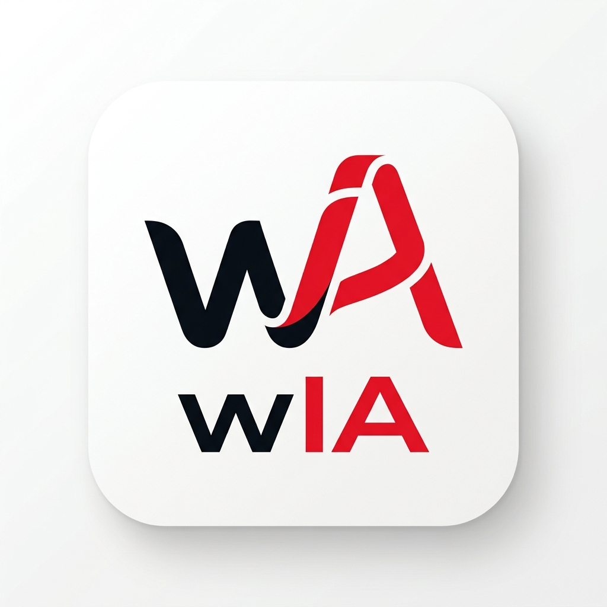

# wIA — Multi-Engine AI Chat Interface (v2606.AF)

**wIA** es un hub de Inteligencia Artificial multimotor — una interfaz de chat avanzada, privada y de alto rendimiento que conecta con **11 proveedores de IA** diferentes. Diseñada como aplicación web estática (HTML/JS/CSS puro, sin framework), puede ejecutarse tanto localmente como desplegada en cualquier servidor web.



---

## 🚀 Características Principales

### Conectividad Multi-Motor
| Proveedor | Tipo | Autenticación | URL por defecto |
|:---|:---|:---|:---|
| **Ollama (Local)** | Ollama nativo | Ninguna | `http://localhost:11434` |
| **Ollama (Remoto)** | Ollama nativo | Bearer opcional | Configurable |
| **Ollama Cloud** | Ollama nativo | API Key | `https://ollama.com` |
| **LM Studio** | OpenAI compatible | Ninguna | `http://localhost:1234/v1` |
| **Groq** | OpenAI compatible | API Key | `https://api.groq.com/openai/v1` |
| **OpenRouter** | OpenAI compatible | API Key | `https://openrouter.ai/api/v1` |
| **Google Gemini** | Gemini nativo | API Key | `https://generativelanguage.googleapis.com/v1beta` |
| **Claude (Anthropic)** | Anthropic nativo | API Key | `https://api.anthropic.com/v1` |
| **OpenAI** | OpenAI nativo | API Key | `https://api.openai.com/v1` |
| **Nvidia Integrate** | OpenAI compatible | API Key | `https://integrate.api.nvidia.com/v1` |
| **WebGPU (Browser)** | Transformers.js en navegador | Ninguna | Sin servidor |

### Funcionalidades Core

- **🔒 Privacidad Total**: Las API Keys se almacenan exclusivamente en `localStorage` del navegador y nunca se envían a terceros (solo al proveedor seleccionado).
- **🧠 WebGPU Local en Navegador**: Inferencia 100% local usando `Transformers.js`, ejecutada en un **Web Worker** para que la interfaz siga fluida durante la generación, con descarga/caché en navegador y barra de estado de carga dentro del chat.
- **📁 Gestión de Proyectos (Workspaces)**: Organiza conversaciones en espacios temáticos con System Prompts independientes.
- **📚 Base de Conocimiento (RAG Local)**: Sube documentos (PDF, TXT, MD, código fuente) por proyecto. La IA los usa como referencia constante.
- **🧠 Modo Pensamiento (Thinking)**: Visualiza el razonamiento de modelos con Chain of Thought. Soporta múltiples formatos: `<think>`, `<|think|>`, Gemini `thought`, Claude `thinking`.
- **🔧 Tool Calling**: Búsqueda integrada en Wikipedia para modelos que soporten herramientas (Ollama, OpenAI).
- **⚡ Streaming en Tiempo Real (60fps)**: Motor de renderizado con `requestAnimationFrame` para visualización fluida del stream sin bloquear el hilo principal.
- **📊 Métricas Geek**: Panel de métricas por mensaje con tokens, velocidad, parámetros, temperatura y provider utilizado.
- **✨ Mejorador de Prompts**: Botón para optimizar automáticamente el prompt del usuario usando IA.
- **🎨 3 Temas Visuales**: Oscuro Premium, Claro Premium y Vanilla (minimalista).
- **🖼️ Soporte de Imágenes**: Envía imágenes para modelos multimodales (visión).
- **🔎 Selector de Modelos por Funcionalidades**: El catálogo visual ahora filtra por `Visión`, `Thinking`, `Código`, `Tools`, `Multiidioma`, `Ligero`, `Grande`, `Gratis` y `Experimental`.
- **🧩 Alta Manual de Modelos WebGPU**: Puedes pegar directamente un repo o URL de Hugging Face para incorporar un modelo al catálogo WebGPU.

### Funcionalidades Avanzadas (Nuevas en v2604.BY)

- **✏️ Editar Mensajes Enviados**: Click en "Editar" para modificar un mensaje y regenerar la conversación desde ese punto.
- **📋 Copiar Respuesta Completa**: Botón para copiar todo el contenido markdown de una respuesta del asistente.
- **🔄 Regenerar Respuesta**: Solicita una nueva respuesta sin necesidad de que haya error.
- **🎙️ Entrada por Voz**: Dictado usando Web Speech API nativa del navegador (sin dependencias externas).
- **📤 Exportar/Importar Chats**: Transfiere o respalda conversaciones completas entre dispositivos usando JSON o MD.
- **💾 Exportar/Importar Ajustes**: Respalda todas tus URLs, modelos preferidos, y API keys en un único archivo JSON.
- **🔢 Estimador de Tokens**: Muestra estimación de tokens en tiempo real mientras escribes (`· ~X tkn`).
- **⭐ Chat Favoritos**: Ancla y marca los chats con estrellita para encontrarlos rápidamente en su propia sección superior.
- **🖱️ Drag & Drop**: Arrastra archivos directamente a la ventana para adjuntarlos.
- **🧠 Auto-Título con IA**: Genera títulos inteligentes automáticamente tras la primera respuesta.
- **⌨️ Atajos de Teclado**: Suite completa de shortcuts para usuarios avanzados.
- **📦 Carga WebGPU por Fases**: El mensaje del asistente muestra estados separados de preparación, descarga, inicialización, generación, cancelación y error.
- **🔗 Enlaces por Proveedor**: El modal enlaza a los catálogos/documentación de modelos según el proveedor activo.
- **🧪 Catálogo WebGPU Curado + Experimental**: El catálogo incluye modelos ligeros, coder, razonamiento, grandes y entradas multimodales visibles para exploración.
- **🕶️ Modo Incógnito**: Las consultas, chats, documentos y adjuntos de la sesión actual no se persisten en `localStorage`.
- **🛡️ Markdown Saneado**: El render del chat filtra HTML peligroso para evitar XSS desde modelos, documentos o contenido restaurado.
- **🔐 Bloqueo Local de Privacidad**: Puedes activar un PIN local al abrir para proteger la interfaz en este navegador compartido.

---

## ⌨️ Atajos de Teclado

| Atajo | Acción |
|:---|:---|
| `Ctrl + N` | Nuevo chat |
| `Ctrl + K` | Buscar conversaciones (focus en búsqueda) |
| `Ctrl + ,` | Abrir Configuración |
| `Ctrl + E` | Mejorar prompt actual |
| `Ctrl + Shift + E` | Exportar chat activo a Markdown |
| `Ctrl + /` | Mostrar guía de atajos |
| `Esc` | Cerrar modales abiertos |

---

## 🛠️ Requisitos

### Para uso Local (Privacidad completa)
1. **Motor de Inferencia** (uno de los siguientes):
   - [Ollama](https://ollama.ai/) ejecutándose en `http://localhost:11434`
   - [LM Studio](https://lmstudio.ai/) en modo Local Server (`http://localhost:1234`)
   - O bien **WebGPU en navegador** para modelos compatibles con Transformers.js
2. **Navegador Moderno**: Chrome, Edge, Brave o similar.

### Para uso Cloud (sin instalación local)
1. Una **API Key** de cualquier proveedor soportado (Groq, OpenRouter, Gemini, Claude, OpenAI o Ollama Cloud).
2. Navegador moderno.

### Configuración CORS para Ollama Local
Si ejecutas wIA desde `file://` y usas Ollama local, necesitas habilitar CORS:

```bash
# Linux/macOS
OLLAMA_ORIGINS="*" ollama serve

# Windows (PowerShell)
$env:OLLAMA_ORIGINS="*"; ollama serve

# Persistente (systemd en Linux)
sudo systemctl edit ollama
# Añadir: Environment="OLLAMA_ORIGINS=*"
```

---

## 📦 Instalación y Uso

### Opción 1: Uso local directo
```bash
# Clona o descarga el repositorio
git clone <repo-url> wIA
cd wIA

# Abre directamente en el navegador
# (Windows)
start index.html
# (macOS)
open index.html
# (Linux)
xdg-open index.html
```

### Opción 2: Servidor local incluido (recomendado)
```bash
node server.js
# Accede en http://localhost:8080
```

`server.js` sirve los estáticos y añade un **proxy CORS** (`/cors-proxy`) para
proveedores que no permiten llamadas directas desde navegador (p. ej. Nvidia
Integrate) o instalaciones de Ollama sin CORS configurado. Detalles:

- **Puerto/host configurables**: `PORT=3000 HOST=0.0.0.0 node server.js`.
  Bajo Plesk/Passenger el puerto lo inyecta el propio panel.
- **Allowlist**: el proxy solo reenvía a hosts conocidos de proveedores de IA
  y a direcciones privadas (localhost, RFC1918, `.local`). Para añadir otros:
  `CORS_PROXY_ALLOW="mi-host.com,otro.com" node server.js`.
- La app **detecta automáticamente** si el proxy existe (health-check); si no
  está, hace las llamadas directas.

### Opción 3: Despliegue web estático
Sube los archivos a cualquier hosting estático (Netlify, Vercel, GitHub Pages,
Apache, Nginx...). No se requiere backend: al no existir `/cors-proxy`, la app
llama directamente a los proveedores (Groq, OpenRouter, Gemini, Claude, OpenAI,
Ollama Cloud y WebGPU funcionan; Nvidia Integrate necesita el proxy porque su
API no envía cabeceras CORS).

### Configuración inicial
1. Abre la aplicación en tu navegador.
2. Haz clic en **⚙️ Configuración** (sidebar en desktop, header en móvil).
3. Selecciona tu **Motor de IA** (proveedor).
4. Introduce tu **API Key** si el proveedor lo requiere.
5. Selecciona un **modelo** del catálogo dinámico filtrando por funcionalidades.
6. **Guardar** y empezar a chatear.

### Uso de WebGPU
1. Selecciona `WebGPU (Browser)` como proveedor.
2. Usa el buscador del catálogo o los filtros funcionales para encontrar un modelo.
3. Si lo necesitas, pega un repo o URL de Hugging Face en el campo manual:
   - `onnx-community/Qwen2.5-Coder-7B-Instruct`
   - `https://huggingface.co/onnx-community/Qwen2.5-Coder-7B-Instruct`
4. Guarda los ajustes y lanza el primer mensaje. La primera carga descargará y cacheará el modelo en el navegador.

> **Nota sobre visión en WebGPU**: Los modelos VLM del catálogo intentan primero el flujo multimodal nativo. Si ese camino falla por limitaciones del runtime de `Transformers.js`, wIA degrada automaticamente al analisis visual local (`image-to-text`) y continúa la respuesta con un modelo de texto.

> **Flujo alternativo de imágenes en WebGPU**: Cuando adjuntas una imagen usando un modelo WebGPU de texto, wIA puede ejecutar primero un modelo local `image-to-text` soportado por `Transformers.js` para extraer una descripcion de la imagen y pasarla como contexto textual al chat. Es una ruta de asistencia visual local, no un VLM conversacional completo.

---

## 📂 Estructura del Proyecto

```
wIA/
├── index.html            # Estructura HTML principal
├── js/                   # Lógica de la app, dividida por dominios
│   │                     # (scripts clásicos con ámbito global compartido;
│   │                     #  el orden de carga en index.html importa)
│   ├── 01-core.js        #   Interceptor CORS, utilidades, saneado HTML,
│   │                     #   registro de proveedores y catálogo WebGPU
│   ├── 02-state.js       #   Estado global, referencias DOM, init,
│   │                     #   persistencia (IndexedDB + localStorage)
│   ├── 03-webgpu.js      #   Runtime WebGPU: caché, soporte, carga inline,
│   │                     #   cliente del worker y despachadores
│   ├── 04-providers.js   #   Conexión a proveedores y gestión de modelos
│   ├── 05-workspace.js   #   PDF, documentos, adjuntos, proyectos y chats
│   ├── 06-chat.js        #   Render de mensajes y streaming multi-protocolo
│   └── 07-ui.js          #   Bindings, atajos, voz, exportación y arranque
├── webgpu-worker.js      # Web Worker de inferencia (Transformers.js fuera
│                         # del hilo principal; fallback automático a inline)
├── server.js             # Servidor estático + proxy CORS con allowlist
│                         # (PORT/HOST por entorno; opcional, la app también
│                         #  funciona en hosting estático puro)
├── styles.css            # Sistema de diseño Antigravity (3 temas)
├── secure-gate.js        # Bloqueo local opcional por PIN
├── favicon.png           # Logotipo oficial de wIA
├── lib/                  # Dependencias locales (PDF.js)
└── README.md             # Esta documentación
```

### Dependencias Externas (CDN)
Todas las dependencias de CDN van **fijadas a versión exacta** y, donde el
navegador lo soporta, con **SRI (integrity)** para que un cambio en el CDN no
pueda romper la app ni inyectar código:

- **[Marked.js](https://marked.js.org/) v15.0.12** (con SRI) — Renderizado de Markdown
- **[Highlight.js](https://highlightjs.org/) v11.9.0** (con SRI) — Resaltado de sintaxis de código
- **[Transformers.js](https://huggingface.co/docs/transformers.js/) v3.8.1** — Inferencia local WebGPU/WASM en navegador
- **[Inter Font](https://fonts.google.com/specimen/Inter)** — Tipografía principal
- **[JetBrains Mono](https://fonts.google.com/specimen/JetBrains+Mono)** — Tipografía monoespaciada

### Dependencias Locales
- **[PDF.js](https://mozilla.github.io/pdf.js/)** — Extracción de texto de PDFs (100% local)

---

## 🏗️ Arquitectura

### Gestión de Estado
```
localStorage
└── antigravity_settings    # Configuración global + per-provider configs

IndexedDB (wia-db)
├── chats                   # Conversaciones y mensajes (incl. imágenes)
└── projects                # Proyectos y knowledge base (documentos)
```

Los chats y documentos viven en **IndexedDB** (cuota de GBs, apta para imágenes
y documentos en base64); los ajustes siguen en `localStorage` por ser pequeños
y necesitarse de forma síncrona. La primera vez que se abre esta versión, los
datos antiguos de `localStorage` **se migran automáticamente** a IndexedDB.

Cada proveedor mantiene su propia configuración independiente (URL, API Key, modelo, temperatura, etc.) en `providerConfigs`. Al cambiar de proveedor, la configuración se guarda automáticamente y se restaura al volver.

### Protocolos de API Soportados

| Protocolo | Proveedores | Endpoints |
|:---|:---|:---|
| **Ollama** | Ollama Local/Remoto/Cloud | `/api/chat`, `/api/tags` |
| **OpenAI** | Groq, OpenRouter, LM Studio, OpenAI | `/chat/completions`, `/models` |
| **Gemini** | Google Gemini | `:streamGenerateContent`, `/models` |
| **Anthropic** | Claude | `/messages` |
| **Transformers.js / WebGPU** | WebGPU (Browser) | Descarga desde Hugging Face + caché local |

### Flujo de Mensajes
```
Usuario → buildMessages() → getAuthHeaders() → fetch(streaming) → processStreamToken() → renderMarkdown() → UI
```

### Selector de Modelos
- Catálogo visual por tarjetas.
- Filtros funcionales dinámicos en vez de listas planas.
- Agrupación por tipo de capacidad:
  - WebGPU: `Ligero`, `Equilibrado / capaz`, `Grande`, `Añadidos manualmente`
  - Resto de proveedores: `Visión`, `Código`, `Thinking`, `Multiidioma`, `Generales`
- El selector conserva el modelo real aunque estés viendo una lista filtrada.

### Catálogo WebGPU Curado
Incluye familias ligeras, coder, matemáticas/razonamiento, grandes y experimentales. Algunos ejemplos:
- `HuggingFaceTB/SmolLM2-360M-Instruct`
- `onnx-community/Llama-3.2-1B-Instruct-ONNX`
- `onnx-community/Qwen2.5-Coder-0.5B-ONNX`
- `onnx-community/Qwen2.5-Coder-3B-Instruct`
- `webgpu/Phi-4-mini-instruct-ONNX-GQA`
- `onnx-community/Apertus-8B-Instruct-2509-ONNX`
- `onnx-community/DeepSeek-R1-Distill-Qwen-1.5B-ONNX` (razonamiento)
- `onnx-community/Qwen2-VL-2B-Instruct` (visión / experimental)
- `onnx-community/Phi-3.5-vision-instruct` (visión / experimental)

> Los IDs guardados con nombres antiguos (p. ej. `Llama-3.2-1B-Instruct` sin
> sufijo `-ONNX`) se migran automáticamente. Los DeepSeek R1 7B/8B se retiraron
> del catálogo porque sus repositorios pasaron a ser *gated* en Hugging Face.

---

## 📱 Responsive Design

La aplicación está optimizada para tres rangos de pantalla:

| Rango | Comportamiento |
|:---|:---|
| **> 768px** (Desktop) | Sidebar fija, controles flotantes al colapsar |
| **≤ 768px** (Tablet) | Sidebar como drawer, header móvil con ⚙️ + ✏️ |
| **≤ 480px** (Móvil) | Tamaños reducidos, cards apiladas, footer compacto |

---

## 🤝 Contribuciones

Si deseas sugerir mejoras o reportar errores, abre un issue o envía un pull request.

### Changelog (última revisión mayor)
- 🚀 **Inferencia WebGPU en Web Worker**: la descarga, compilación y generación de modelos locales corre ahora en `webgpu-worker.js`, fuera del hilo principal — la interfaz sigue fluida durante la inferencia. Fallback automático al hilo principal si el worker no está disponible (p. ej. `file://`) o su contexto no alcanza WebGPU.
- 🔧 **Fix crítico de carga WebGPU**: Hugging Face pasó a responder los metadatos con redirecciones relativas (`/api/resolve-cache/...`) que el proxy CORS rompía; los hosts de HF ya no se proxyan (sirven CORS correcto) y el proxy reescribe cabeceras `Location`.
- 📡 **Streaming WebGPU real**: migrado a `TextStreamer` + `InterruptableStoppingCriteria` de Transformers.js v3 (la API antigua `callback_function` era ignorada): tokens en vivo, métricas T/s y botón detener que corta la generación en ~200 ms.
- 💾 **Persistencia en IndexedDB**: chats, proyectos y documentos se guardan en IndexedDB (cuota de GBs) con migración automática desde `localStorage`; los ajustes permanecen en `localStorage`.
- 🧩 **Código modularizado**: `app.js` (6.900 líneas) dividido en 7 módulos por dominio bajo `js/`.
- 🌐 **Despliegue estático sin fricción**: la app detecta si `/cors-proxy` existe; sin él, llama directamente a los proveedores (todos menos Nvidia soportan CORS).
- 🛡️ **Proxy endurecido**: allowlist de hosts, health-check, reescritura de redirecciones y `PORT`/`HOST` por variables de entorno (listo para Plesk/Passenger).
- 🤖 **Modelos Claude dinámicos**: la lista se obtiene de `GET /v1/models` (antes: lista fija obsoleta y un ping facturable contra `/messages`).
- 🎯 **dtype adaptativo**: se detecta `shader-f16` y `powerPreference: high-performance`; sin f16 (o en WASM) las variantes `q4f16` degradan automáticamente a `q4`.
- 📚 **Catálogo saneado**: IDs de Llama 3.2 actualizados al sufijo `-ONNX` (con migración), DeepSeek R1 7B/8B retirados (repos *gated*), detección de caché compatible con las nuevas URLs `resolve-cache`.
- 🎨 **Resaltado de sintaxis restaurado**: desde marked v5 la opción `highlight` no existía; ahora se aplica `hljs` sobre el DOM en `processCodeBlocks`.
- 📌 **CDNs fijados con SRI**: marked 15.0.12 y highlight.js 11.9.0 con hash de integridad; Transformers.js fijado a 3.8.1.
- 🧠 **VRAM liberada al cambiar de modelo**: el pipeline anterior se libera con `dispose()` antes de cargar otro.
- 🖥️ **Render de streaming robusto**: el frame pendiente ya no se cancela por token (podía retrasar el pintado indefinidamente) y con la pestaña oculta se usa un temporizador porque `requestAnimationFrame` no se ejecuta.

### Changelog Reciente (v2604.BY)
- 🕶️ **Historial lateral oculto en Incógnito**: mientras la sesión privada está activa, la columna de historial deja de mostrar conversaciones para evitar memoria visual accidental.
- 🧩 **Progreso WebGPU menos engañoso**: la instalación de artefactos ya no salta a `100%` con el primer `tokenizer.json`; ahora reserva el 100% para el cierre real del pipeline.
- 🍔 **Navegación global integrada**: `wIA` incluye ahora un menú hamburguesa flotante para volver al portal o saltar a otra app Tligent a pantalla completa.
- ⏳ **Feedback extendido de carga WebGPU**: la tarjeta ya diferencia mejor preparación, descarga, instalación de artefactos e inicialización final del pipeline.
- 🛡️ **XSS mitigado en el chat**: el Markdown renderizado pasa ahora por saneado HTML antes de insertarse en el DOM.
- 🕶️ **Modo Incógnito añadido**: chats, mensajes y documentos dejan de persistirse en `localStorage` mientras el modo está activo.
- 💾 **Persistencia transaccional en documentos**: si el navegador alcanza su cuota local, el documento no se queda añadido “a medias” y se avisa al usuario.
- 🔐 **Bloqueo local conectado al arranque**: `secure-gate.js` se carga realmente al iniciar y pasa a funcionar como bloqueo de privacidad configurable por PIN local, sin secretos hardcodeados.
- 🧠 **Phi-4 Mini más robusto en WebGPU**: si la variante `q4f16` falla al inicializar, la app reintenta automáticamente con `q4` para mejorar compatibilidad en navegadores/GPUs justos.
- 🧩 **Errores numéricos WebGPU mejor clasificados**: códigos opacos como `11202960` ya no se muestran como detalle técnico desnudo, sino como fallo interno del runtime con una recomendación más útil.
- 🧠 **WebGPU Integrado**: Nuevo proveedor `WebGPU (Browser)` con inferencia local vía `Transformers.js`.
- ⏳ **Mensaje de Carga Estructurado**: El chat ahora diferencia `Preparando`, `Descargando`, `Inicializando`, `Generando`, `Cancelado` y `Error`.
- 🔎 **Selector por Funcionalidades**: Catálogo reorganizado y filtrable por capacidades (`Visión`, `Thinking`, `Código`, `Tools`, etc.).
- 🧩 **Alta Manual de Modelos WebGPU**: Pega una URL/repo de Hugging Face para añadirlo al catálogo y seleccionarlo.
- 👁 **Detección de Modelos de Visión**: El catálogo identifica modelos multimodales y los etiqueta como experimentales cuando procede.
- 👁 **Catálogo de visión corregido**: `Phi 3.5 Vision` y `Qwen2 VL 2B` vuelven a mostrarse como explorables/experimentales, no como chat multimodal fiable en WebGPU, para alinearse con las limitaciones reales de `Transformers.js`.
- 🖼 **Flujo alternativo de imágenes en WebGPU**: las imágenes adjuntas ahora pueden convertirse localmente en descripcion (`image-to-text`) y usarse como contexto dentro del chat WebGPU de texto.
- 🔁 **Fallback automatico VLM → analisis visual local**: los modelos de vision WebGPU intentan primero el chat multimodal nativo y, si falla, la app recupera la conversacion usando OCR/descripcion local de imagen y un modelo de texto de respaldo.
- ✅ **Fix Phi-4 Mini WebGPU**: el catálogo ahora apunta al repo ONNX correcto (`Phi-4-mini-instruct-ONNX-GQA`) y migra automáticamente configuraciones antiguas guardadas con el ID incorrecto.
- ✨ **Carga WebGPU más estable visualmente**: el monitor de descarga ahora limita la frecuencia de refresco para evitar parpadeos molestos durante la preparación de modelos.
- 🧹 **Historial y reset separados**: la zona de peligro ahora distingue entre `Limpiar historial` (conserva ajustes) y `Reset de fábrica` (borra también la configuración). Además se corrigió el bug por el que antes no se eliminaban bien los chats persistidos.
- 🔗 **URL visible en carga/error WebGPU**: la tarjeta de carga ahora muestra la URL de origen del modelo y permite copiarla al portapapeles. También se endureció el detalle técnico para no mostrar `undefined`.
- ✅ **Fix adicional Phi-4 Mini**: el catálogo pasa a `webgpu/Phi-4-mini-instruct-ONNX-GQA`, una variante corregida para WebGPU/Transformers.js.
- 🎞 **Barra de descarga más suave**: la tarjeta de carga WebGPU ya no se reconstruye entera en cada tick; ahora actualiza de forma incremental su barra y porcentaje para evitar tirones visuales.
- 🔗 **Enlaces de Catálogo por Proveedor**: Acceso directo a documentación/listados de modelos desde el modal.
- ✅ Fix importante: guardar ajustes con filtros activos ya no cambia silenciosamente el modelo seleccionado.
- ✅ Fix: el `accept` del upload conserva PDFs y adjuntos no visuales cuando el modelo no soporta imágenes.
- ⚡ **Optimización de Renderizado (Speed Up)**: Renderizado Markdown `marked.setOptions()` de una sola pasada. Scroll fluido gracias a `requestAnimationFrame` (60fps lock stream update). `debounce` para entradas de búsqueda. Nodos HTML inmutables.
- 💾 **Export/Import Inteligente de Ajustes**: Nuevo botón en Modal para volcar el JSON config de proveedores.
- ⭐ **Favoritos en Sidebar**: Selección por estrellitas con animación pulse dorada y prioridad visual.
- ✅ Fix crítico: `ollama_cloud` añadido a `providerConfigs` (las API Keys ahora persisten)
- ✅ Fix: `renderActiveChat()` → `renderMessages()` en retry de errores

---

*Desarrollado con ❤️ por [TLIGENT IA](https://tligent.com) · Sistema de diseño Antigravity*
